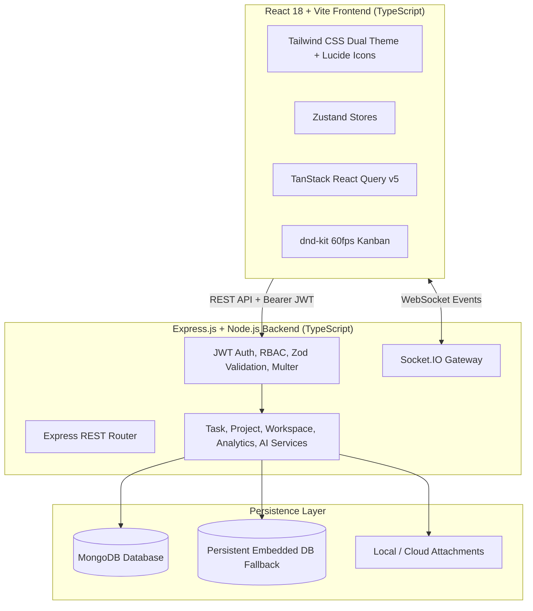

# TaskFlow — Modern Full-Stack Project & Task Management Platform

[](https://www.typescriptlang.org/)
[](https://reactjs.org/)
[](https://vitejs.dev/)
[](https://nodejs.org/)
[](https://expressjs.com/)
[](https://www.mongodb.com/)
[](https://socket.io/)
[](https://tailwindcss.com/)
[](https://www.docker.com/)
[](https://opensource.org/licenses/MIT)

**TaskFlow** is an enterprise-grade, high-performance project and task management system built with the **MERN** stack (MongoDB, Express, React, Node.js) and **TypeScript**. Engineered for zero-lag responsiveness and collaborative workflows, TaskFlow features real-time WebSocket synchronization, role-based access control (RBAC), 60 FPS drag-and-drop Kanban boards, an AI-powered project decomposition engine, interactive calendar scheduling, and a dual-theme design system.

---

## 🌟 Key Features

### 🎨 1. Tailored Dual-Theme Design System
- **Unified Lighting Blue Dark Theme**: Built on a deep obsidian canvas (`#0B0F17` / `#111827`) with vibrant **Electric / Lighting Blue** (`#3B82F6` / `#2563EB`) primary accents, active navigation pills, focus rings, and badges.
- **Imperial Maroon & Cream Bright Theme**: Built on a soft **Warm Ivory Cream** canvas (`#FAF6EE` / `#FFFDF9`) paired with **Imperial Maroon** (`#800020`) buttons and accents.
- **Dynamic Browser Customization**: High-resolution vector SVG favicon with route-aware page titles (`Dashboard · TaskFlow`, `My Tasks · TaskFlow`, `Projects · TaskFlow`, etc.).
- **Minimalist Top Navigation**: Streamlined top bar featuring avatar-only profile navigation with rich user details nested within the dropdown.

### 🔐 2. Authentication & Persistent Sessions
- **Flexible Sign-In**: Login using either your **Email Address** or **Username**.
- **Remember Me (30 Days)**: Persistent authentication token stored securely with auto-fill memory and instant auto-login routing.
- **Role-Based Access Control (RBAC)**: System roles (`USER`, `PROJECT_MANAGER`, `ADMIN`) and Workspace roles (`OWNER`, `ADMIN`, `MEMBER`).
- **Comprehensive Password Security**: Built-in 8+ char rule indicators with uppercase and number validation + password reset workflow.

### 📋 3. 60 FPS Real-Time Kanban Board
- **Fluid Drag & Drop**: Powered by `@dnd-kit/core` and `@dnd-kit/sortable` with memoized components for dropped-frame-free interactions.
- **Columns**: `To Do`, `In Progress`, `In Review`, and `Completed`.
- **Optimistic UI Updates**: Immediate client updates with automatic rollback on network latency.
- **Fractional Index Ordering**: Prevents race conditions during simultaneous reordering.

### 🤖 4. AI-Powered Project Planner & Breakdown
- **Natural Language Decomposition**: Converts natural language prompts (e.g., *"Build an e-commerce platform with Stripe checkout"*) into structured tasks, priorities, and hourly estimates.
- **Target Project Routing**: Review, customize, and push AI-architected tasks directly to any project board.
- **Zero-Config Fallback**: Works out of the box even without external API credentials.

### ⚡ 5. Real-Time Collaboration & Sockets
- **Socket.IO Gateway**: Dedicated workspace and project rooms for live synchronization.
- **Live Updates**: Instant status transitions, comment additions, and time logs across all teammates.
- **Rich Comments & @Mentions**: Comment threads with `@username` tagging and notification delivery.
- **Audit Logs**: Full activity history of all workspace actions.

### 📅 6. Interactive Calendar & Hourly Timeline
- **Dual View**: Monthly date picker synchronized with hourly daily time slots (8:00 AM – 8:00 PM).
- **Deadline Tracking**: Overdue indicators, today/tomorrow badges, and fast task creation directly into specific time slots.

### 📊 7. Analytics & Workload Metrics
- **Visual Dashboards**: Powered by Recharts with task velocity trends (7-day completion timeline), status donuts, priority bar charts, and team member workload distribution tables.

---

## 🏗️ Architecture & Data Flow



---

## 💻 Tech Stack

| Layer | Technology | Details |
|---|---|---|
| **Frontend Framework** | React 18, Vite 6, TypeScript | Modular SPA with code-splitting and zero lag |
| **Styling** | Tailwind CSS 3.4, Lucide Icons | Dual-theme (Lighting Blue Dark & Cream/Maroon Bright) |
| **State Management** | Zustand, TanStack Query v5 | Lightweight client state & optimistic server cache |
| **Drag & Drop** | `@dnd-kit/core`, `@dnd-kit/sortable` | 60 FPS accessible touch/mouse drag & drop |
| **Visualizations** | Recharts | Responsive velocity charts, donut status, workload tables |
| **Backend API** | Node.js 20+, Express.js, TypeScript | RESTful MVC architecture with clean service layer |
| **Database** | MongoDB 7.0, Mongoose 8 | Document store + embedded persistent fallback |
| **Realtime** | Socket.IO 4.8 | Low-latency room broadcasting |
| **Validation** | Zod | End-to-end schema validation |
| **Testing** | Vitest, Supertest | Full unit and integration test suite |
| **DevOps** | Docker, Docker Compose | Containerized production deployment |

---

## 📁 Repository Structure

```text
TaskFlow/
├── client/                     # Frontend Application (React + Vite + TypeScript)
│   ├── public/                 # Static assets & SVG Favicon
│   ├── src/
│   │   ├── components/         # Reusable UI & Feature components
│   │   │   ├── common/         # Buttons, Inputs, Modals, Navbar, Sidebar, Toasts
│   │   │   ├── kanban/         # KanbanBoard, KanbanColumn, TaskCard
│   │   │   └── tasks/          # TaskDetailModal, CreateTaskModal, TimeTracker, Subtasks
│   │   ├── layouts/            # AppLayout
│   │   ├── lib/                # Axios, Socket, DateUtils, CN utilities
│   │   ├── pages/              # Dashboard, Tasks, Projects, Calendar, Team, Settings, Auth
│   │   ├── routes/             # Lazy-loaded AppRoutes with dynamic titles
│   │   ├── store/              # Zustand stores (Auth, Theme, Toast, Confirm, Workspace)
│   │   └── types/              # TypeScript interfaces and models
│   ├── tailwind.config.js      # Palette tokens (Maroon, Cream, Dark Obsidian, Lighting Blue)
│   └── vite.config.ts          # Rollup manual chunk vendor code-splitting
├── server/                     # Backend API (Node.js + Express + TypeScript)
│   ├── src/
│   │   ├── config/             # DB connection (MongoDB + Embedded fallback), Sockets
│   │   ├── controllers/        # Request handlers (Auth, Task, Project, Workspace, Analytics, AI)
│   │   ├── middleware/         # Auth, RBAC, Error handler, Rate limiter, Uploads
│   │   ├── models/             # Mongoose schemas (User, Task, Project, Workspace, Notification)
│   │   ├── routes/             # Express API routes
│   │   ├── services/           # Business logic & aggregation pipelines
│   │   └── validators/         # Zod request validators
│   └── tests/                  # Integration & API tests
├── docker-compose.yml          # Multi-container full-stack deployment
└── README.md                   # Project documentation
```

---

## ⚡ Quick Start Guide

### Prerequisites
- **Node.js** (v20+ LTS recommended)
- **npm** (v9+)
- *(Optional)* **MongoDB** (If local MongoDB is not running, TaskFlow will automatically launch a persistent embedded database for you seamlessly!)

---

### 1. Clone the Repository

```bash
git clone https://github.com/VinayKrishna-7/TaskFlow.git
cd TaskFlow
```

---

### 2. Install Dependencies

```bash
# Install root dependencies
npm install

# Install server dependencies
cd server
npm install

# Install client dependencies
cd ../client
npm install
cd ..
```

---

### 3. Setup Environment Variables

```bash
# From the project root:
cp server/.env.example server/.env
cp client/.env.example client/.env
```

*Default environment variables are pre-configured to run out-of-the-box on `http://localhost:5000` (Backend) and `http://localhost:5173` (Frontend).*

---

### 4. (Optional) Seed Sample Data

To populate sample users, workspaces, projects, and Kanban tasks:

```bash
cd server
npm run seed
cd ..
```

---

### 5. Run Development Servers

From the project root:
```bash
npm run dev
```

Or start both services individually:
```bash
# Terminal 1 - Backend Server
cd server
npm run dev

# Terminal 2 - Frontend Client
cd client
npm run dev
```

Visit the application:
- **Frontend App**: `http://localhost:5173`
- **Backend API**: `http://localhost:5000/api`
- **Swagger Documentation**: `http://localhost:5000/api-docs`
- **Health Check**: `http://localhost:5000/api/health`

---

## 🐳 Docker Deployment

To build and run the complete application stack (MongoDB, Express API, and Nginx-served Client):

```bash
docker-compose up --build
```

Access points:
- **Frontend Application**: `http://localhost:80`
- **Backend API**: `http://localhost:5000/api`
- **Swagger API Docs**: `http://localhost:5000/api-docs`

To stop containers:
```bash
docker-compose down
```

---

## 🧪 Testing

### Backend API Tests
Runs 20 automated integration tests covering authentication, token refresh, workspace access, task state machine, time tracking, comments, and analytics:

```bash
cd server
npm test
```

### Frontend Component Tests
Runs client tests for rendering, button states, inputs, and badge variations:

```bash
cd client
npm test
```

### Client Production Build Check
```bash
cd client
npm run build
```

---

## 📖 API Reference Summary

Interactive Swagger OpenAPI docs are available at `/api-docs`.

### Authentication (`/api/auth`)
| Method | Endpoint | Description |
|---|---|---|
| `POST` | `/api/auth/register` | Register a new user account |
| `POST` | `/api/auth/login` | Authenticate user (email or username) & return JWTs |
| `POST` | `/api/auth/refresh` | Rotate and issue new access token |
| `POST` | `/api/auth/logout` | Revoke active refresh token session |
| `GET` | `/api/auth/me` | Retrieve authenticated user profile |
| `PUT` | `/api/auth/profile` | Update display name, username, or avatar |
| `PUT` | `/api/auth/change-password` | Update account password |

### Workspaces (`/api/workspaces`)
| Method | Endpoint | Description |
|---|---|---|
| `GET` | `/api/workspaces` | Get all workspaces for current user |
| `POST` | `/api/workspaces` | Create new workspace |
| `GET` | `/api/workspaces/:id` | Get workspace details & members |
| `PUT` | `/api/workspaces/:id` | Update workspace settings |
| `DELETE` | `/api/workspaces/:id` | Delete workspace |
| `POST` | `/api/workspaces/:id/invite` | Invite team member (by email/username) |
| `DELETE` | `/api/workspaces/:id/members/:userId` | Remove team member from workspace |

### Projects (`/api/projects`)
| Method | Endpoint | Description |
|---|---|---|
| `GET` | `/api/projects` | List projects with completion stats |
| `POST` | `/api/projects` | Create project with key identifier |
| `GET` | `/api/projects/:id` | Get project overview & task stats |
| `PUT` | `/api/projects/:id` | Update project details |
| `DELETE` | `/api/projects/:id` | Delete project and associated tasks |

### Tasks & AI Planner (`/api/tasks`, `/api/ai`)
| Method | Endpoint | Description |
|---|---|---|
| `GET` | `/api/tasks` | Query tasks with search, filters & pagination |
| `POST` | `/api/tasks` | Create new task |
| `GET` | `/api/tasks/:id` | Get full task detail (subtasks, attachments, logs) |
| `PUT` | `/api/tasks/:id` | Update task fields |
| `PUT` | `/api/tasks/:id/move` | Update status & Kanban ordering position |
| `DELETE` | `/api/tasks/:id` | Delete task |
| `POST` | `/api/tasks/:id/duplicate` | Clone task |
| `POST` | `/api/tasks/:id/time` | Log time entry (stopwatch or manual) |
| `POST` | `/api/ai/breakdown` | AI prompt to structured task generator |

---

## 📄 License

This project is licensed under the **MIT License** — feel free to use, modify, and distribute.
