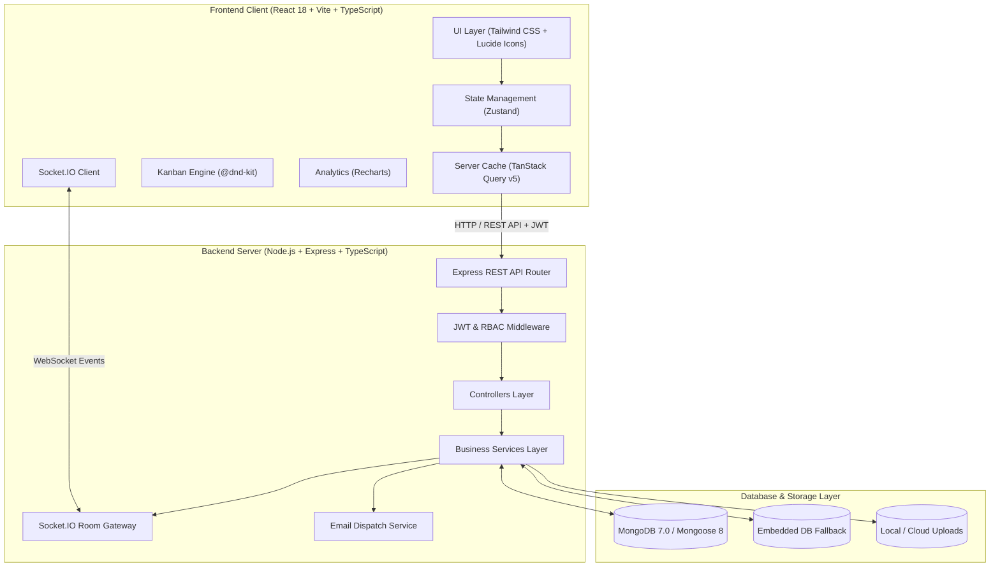

# TaskFlow — Modern Full-Stack Project & Task Management Platform

[](https://www.typescriptlang.org/)
[](https://reactjs.org/)
[](https://vitejs.dev/)
[](https://nodejs.org/)
[](https://expressjs.com/)
[](https://www.mongodb.com/)
[](https://socket.io/)
[](https://tailwindcss.com/)
[](https://www.docker.com/)
[](https://opensource.org/licenses/MIT)

**TaskFlow** is a modern, enterprise-grade project and task management system engineered with the **MERN** stack (MongoDB, Express, React, Node.js) and written in **TypeScript**. Designed for high-velocity teams, TaskFlow combines zero-latency optimistic interactions, 60 FPS drag-and-drop Kanban workflows, real-time multi-client WebSockets, an AI-powered project decomposition engine, an interactive calendar timeline, and an executive analytics suite into a unified, dual-theme SaaS platform.

---

## 📑 Table of Contents

- [Key Features](#-key-features)
- [System Architecture](#-system-architecture)
- [Tech Stack](#-tech-stack)
- [Project Directory Structure](#-project-directory-structure)
- [Quick Start Guide](#-quick-start-guide)
  - [Prerequisites](#prerequisites)
  - [1. Clone Repository](#1-clone-the-repository)
  - [2. Install Dependencies](#2-install-dependencies)
  - [3. Configure Environment Variables](#3-setup-environment-variables)
  - [4. Seed Sample Data](#4-optional-seed-sample-data)
  - [5. Run Development Servers](#5-run-development-servers)
- [Docker Deployment](#-docker-deployment)
- [Testing & Quality Assurance](#-testing--quality-assurance)
- [API Reference](#-api-reference)
- [Environment Configuration](#-environment-configuration-reference)
- [License & Author](#-license--author)

---

## 🌟 Key Features

### 📋 1. Multi-Project & Workspace Task Management ("My Tasks")
- **Workspace-Wide Aggregation**: View all tasks across every project in the active workspace on a single unified board or table.
- **Dynamic Project Filtering**: Instant switching between "All Projects" and individual project views.
- **Deep Multi-Field Search**: Real-time keyword search across task titles, descriptions, unique task numbers (`#1`, `#2`), labels/tags, project names/keys, and team assignees.
- **URL Parameter Synchronization**: Search queries and active filters automatically sync with browser URL parameters (`/tasks?search=...&project=...&status=...&overdue=true`) for seamless bookmarking and sharing.
- **Dual Display Modes**: Toggle between a dense, sorting-capable List/Table view and responsive Grid Cards.

### 📊 2. Executive Interactive Dashboard
- **Clickable KPI Metric Cards**: Fast, one-click drill-downs into filtered task views:
  - **Total Tasks**: Opens the complete workspace task registry.
  - **In Progress**: Instantly filters for tasks currently in flight (`/tasks?status=IN_PROGRESS`).
  - **Completion Rate**: Navigates directly to completed deliverables (`/tasks?status=COMPLETED`) with task count context.
  - **Overdue Tasks**: Jumps directly to tasks requiring urgent intervention (`/tasks?overdue=true`).
- **Complete 360° Status Ring**: Smooth, continuous Recharts donut chart with non-zero filtering, background stroke separators, and consistent status-to-color mapping.
- **7-Day Velocity Tracking**: Responsive bar chart illustrating daily completion throughput.
- **Upcoming Deadlines & Real-time Audit Timeline**: Immediate task detail modal triggers and workspace-wide action feeds.

### 📌 3. 60 FPS Real-Time Kanban Board
- **Fluid Drag-and-Drop**: Built using `@dnd-kit/core` and `@dnd-kit/sortable` with memoized render loops for dropped-frame-free interactions.
- **Configurable Workflow Stages**: `To Do`, `In Progress`, `In Review`, and `Completed`.
- **Optimistic UI Updates**: Instant client-side state mutation with automatic rollbacks upon unexpected server responses.
- **Fractional Index Ordering**: Collision-free position sorting preventing race conditions during concurrent updates.

### 🤖 4. AI-Powered Project Planner & Breakdown
- **Natural Language Task Decomposition**: Converts high-level prompts (e.g., *"Build an automated CI/CD pipeline with Docker and GitHub Actions"*) into structured tasks, subtasks, priorities, and hourly estimates.
- **Target Project Routing**: Review, customize, and push AI-architected tasks directly to any project board.
- **Zero-Config Fallback**: Features an intelligent local decomposition engine that works out of the box without requiring external API keys.

### ⚡ 5. Real-Time Collaboration & Sockets
- **Socket.IO Gateway**: Dedicated workspace and project rooms for live synchronization.
- **Instant Broadcasts**: Live status movements, comment additions, and time logs across all connected teammates.
- **Rich Comments & @Mentions**: Comment threads with `@username` tagging and notification delivery.
- **Audit Logs**: Full activity history of all workspace actions.

### 📅 6. Interactive Calendar & Hourly Timeline
- **Synchronized Scheduling**: Monthly mini-calendar synchronized with an hourly daily timeline (8:00 AM – 8:00 PM).
- **Deadline Monitoring**: Overdue indicators, today/tomorrow badges, and rapid task creation directly into target time slots.

### 🎨 7. Tailored Dual-Theme Design System
- **Electric Blue Dark Mode**: Deep obsidian background (`#0B0F17` / `#111827`) paired with vibrant **Electric / Lighting Blue** (`#3B82F6` / `#2563EB`) accents, glow rings, and badges.
- **Imperial Maroon & Cream Light Mode**: Warm ivory canvas (`#FAF6EE` / `#FFFDF9`) paired with **Imperial Maroon** (`#800020`) primary buttons and highlights.
- **High-Contrast Tooltips**: Recharts tooltips engineered with crisp contrast in both themes.
- **Clickable Brand Header**: Instant home navigation from the sidebar brand logo.

### 🔐 8. Authentication & Persistent Sessions
- **Flexible Sign-In**: Login via **Email Address** or **Username**.
- **Extended Session Lifetime**: Configured with 7-day access and 30-day refresh token rotation to eliminate unwanted logouts.
- **Password Recovery Flow**: Forgot password and reset password workflow with secure token generation, email dispatch, and auto-prefilled authentication redirects.
- **Role-Based Access Control (RBAC)**: System roles (`USER`, `PROJECT_MANAGER`, `ADMIN`) and Workspace roles (`OWNER`, `ADMIN`, `MEMBER`).

---

## 🏗️ System Architecture



---

## 💻 Tech Stack

| Layer | Technology | Purpose |
|---|---|---|
| **Frontend Framework** | React 18, Vite 6, TypeScript | Modular Single Page Application with optimized bundle splitting |
| **Styling & UI** | Tailwind CSS 3.4, Lucide Icons | Dual-theme system (Electric Blue & Imperial Maroon/Cream) |
| **State & Cache** | Zustand, TanStack Query v5 | Client store, optimistic updates, and automatic cache invalidation |
| **Drag & Drop** | `@dnd-kit/core`, `@dnd-kit/sortable` | 60 FPS accessible touch and mouse Kanban interactions |
| **Data Visualization** | Recharts | Responsive velocity charts, complete $360^\circ$ status donuts, workload bars |
| **Backend API** | Node.js 20+, Express.js, TypeScript | RESTful MVC architecture with clean service separation |
| **Database** | MongoDB 7.0, Mongoose 8 | Document store with persistent embedded fallback |
| **Realtime Gateway** | Socket.IO 4.8 | Low-latency room broadcasting for concurrent updates |
| **Request Validation** | Zod | Runtime input schema validation |
| **Testing** | Vitest, Supertest | Integration and unit test suite with isolated test DB |
| **Containerization** | Docker, Docker Compose | Production container deployment with multi-stage builds |

---

## 📁 Project Directory Structure

```text
TaskFlow/
├── client/                           # Frontend React SPA
│   ├── public/                       # Static assets & SVG favicon
│   ├── src/
│   │   ├── components/               # UI components
│   │   │   ├── common/               # Avatar, Badge, Button, Input, Modal, Navbar, Sidebar
│   │   │   ├── kanban/               # KanbanBoard, KanbanColumn, TaskCard
│   │   │   └── tasks/                # CreateTaskModal, TaskDetailModal, TimeTracker, Subtasks
│   │   ├── layouts/                  # AppLayout (Sidebar + Navbar + Content wrapper)
│   │   ├── lib/                      # Axios client, Socket client, Date utilities, cn helpers
│   │   ├── pages/                    # Dashboard, Tasks, Projects, Calendar, Analytics, Team, Auth
│   │   ├── routes/                   # Protected routes with lazy loading and dynamic page titles
│   │   ├── store/                    # Zustand stores (Auth, Theme, Workspace, Toast, Confirm)
│   │   └── types/                    # TypeScript interfaces (User, Workspace, Project, Task, etc.)
│   ├── index.html                    # HTML entry point
│   ├── tailwind.config.js            # Theme tokens, custom colors, and typography
│   └── vite.config.ts                # Build configuration with Rollup chunk splitting
├── server/                           # Backend API
│   ├── src/
│   │   ├── config/                   # MongoDB connection & embedded fallback logic
│   │   ├── controllers/              # Auth, Task, Project, Workspace, Analytics, AI controllers
│   │   ├── middleware/               # Auth guard, RBAC, error handler, rate limiter, uploads
│   │   ├── models/                   # Mongoose models (User, Task, Project, Workspace, Activity)
│   │   ├── routes/                   # Express route definitions
│   │   ├── services/                 # Business logic, aggregation pipelines, email service
│   │   ├── sockets/                  # Socket.IO event managers and room gateways
│   │   ├── utils/                    # Token generation, password hashing, API responses
│   │   └── validators/               # Zod validation schemas
│   ├── tests/                        # Vitest integration and API tests
│   └── vitest.config.ts              # Test configuration with isolated test database
├── docker-compose.yml                # Multi-container orchestration
└── README.md                         # Project documentation
```

---

## ⚡ Quick Start Guide

### Prerequisites
- **Node.js** (v20+ LTS recommended)
- **npm** (v9+)
- *(Optional)* **MongoDB** (If local MongoDB is not running, TaskFlow automatically starts an embedded persistent database fallback seamlessly!)

---

### 1. Clone the Repository

```bash
git clone https://github.com/VinayKrishna-7/TaskFlow.git
cd TaskFlow
```

---

### 2. Install Dependencies

Install root, server, and client dependencies:

```bash
# Install root dependencies
npm install

# Install server dependencies
cd server
npm install

# Install client dependencies
cd ../client
npm install
cd ..
```

---

### 3. Setup Environment Variables

Copy the example environment files for both server and client:

```bash
# From the project root:
cp server/.env.example server/.env
cp client/.env.example client/.env
```

*The default settings are pre-configured to run out of the box on `http://localhost:5000` (Backend) and `http://localhost:5173` (Frontend).*

---

### 4. (Optional) Seed Sample Data

Populate sample users, workspaces, projects, Kanban tasks, and activities:

```bash
cd server
npm run seed
cd ..
```

---

### 5. Run Development Servers

From the project root:
```bash
npm run dev
```

Or start backend and frontend in separate terminals:

```bash
# Terminal 1 - Backend Server (Port 5000)
cd server
npm run dev

# Terminal 2 - Frontend Client (Port 5173)
cd client
npm run dev
```

#### Application Endpoints:
- **Web Application**: `http://localhost:5173`
- **REST API Base**: `http://localhost:5000/api`
- **Interactive Swagger Docs**: `http://localhost:5000/api-docs`
- **Health Check**: `http://localhost:5000/api/health`

---

## 🐳 Docker Deployment

Run the complete multi-container stack (MongoDB, Express API, and Nginx-served Client) with one command:

```bash
docker-compose up --build
```

#### Containerized Endpoints:
- **Frontend App**: `http://localhost:80`
- **Backend API**: `http://localhost:5000/api`
- **Swagger Docs**: `http://localhost:5000/api-docs`

To stop the containers:
```bash
docker-compose down
```

---

## 🧪 Testing & Quality Assurance

### Run Backend API Integration Tests
Runs 20 automated integration tests covering authentication, token refresh, workspace authorization, task CRUD, state transitions, time tracking, comments, and analytics:

```bash
cd server
npm test
```

### Run Client Production Build Verification
Ensures TypeScript compiles cleanly with zero type errors and bundles successfully:

```bash
cd client
npm run build
```

---

## 📖 API Reference

### Authentication (`/api/auth`)
| Method | Endpoint | Description |
|---|---|---|
| `POST` | `/api/auth/register` | Register a new user account |
| `POST` | `/api/auth/login` | Authenticate user (via email or username) & return JWTs |
| `POST` | `/api/auth/refresh` | Rotate and issue new access token |
| `POST` | `/api/auth/logout` | Revoke active refresh token session |
| `POST` | `/api/auth/forgot-password` | Send password reset token to user email |
| `POST` | `/api/auth/reset-password` | Reset password using verified token |
| `GET` | `/api/auth/me` | Retrieve authenticated user profile |
| `PUT` | `/api/auth/profile` | Update profile information |

### Workspaces (`/api/workspaces`)
| Method | Endpoint | Description |
|---|---|---|
| `GET` | `/api/workspaces` | Get all workspaces for current user |
| `POST` | `/api/workspaces` | Create new workspace |
| `GET` | `/api/workspaces/:id` | Get workspace details and members |
| `PUT` | `/api/workspaces/:id` | Update workspace settings |
| `DELETE` | `/api/workspaces/:id` | Delete workspace |
| `POST` | `/api/workspaces/:id/invite` | Invite user to workspace |
| `DELETE` | `/api/workspaces/:id/members/:userId` | Remove member from workspace |

### Projects (`/api/projects`)
| Method | Endpoint | Description |
|---|---|---|
| `GET` | `/api/projects?workspaceId=...` | List projects for a workspace |
| `POST` | `/api/projects` | Create a new project with key identifier |
| `GET` | `/api/projects/:id` | Get project details & metrics |
| `PUT` | `/api/projects/:id` | Update project metadata |
| `DELETE` | `/api/projects/:id` | Delete project and associated tasks |

### Tasks (`/api/tasks`)
| Method | Endpoint | Description |
|---|---|---|
| `GET` | `/api/tasks` | Query tasks with search, project, status, priority, and overdue filters |
| `POST` | `/api/tasks` | Create new task |
| `GET` | `/api/tasks/:id` | Get task details, attachments, and subtasks |
| `PUT` | `/api/tasks/:id` | Update task details |
| `PUT` | `/api/tasks/:id/move` | Update status and Kanban board position |
| `DELETE` | `/api/tasks/:id` | Delete task |
| `POST` | `/api/tasks/:id/duplicate` | Duplicate an existing task |
| `POST` | `/api/tasks/:id/time` | Log time entry for task |
| `POST` | `/api/tasks/:id/subtasks` | Add subtask to checklist |
| `PUT` | `/api/tasks/:id/subtasks/:subtaskId/toggle` | Toggle subtask completion status |
| `POST` | `/api/tasks/:id/attachments` | Upload file attachment |

### AI Planner (`/api/ai`)
| Method | Endpoint | Description |
|---|---|---|
| `POST` | `/api/ai/breakdown` | Deconstruct natural language prompt into structured tasks and estimates |

### Analytics & Activity (`/api/analytics`, `/api/activity`)
| Method | Endpoint | Description |
|---|---|---|
| `GET` | `/api/analytics/workspace/:id` | Get status counts, velocity trends, priority distribution, and workloads |
| `GET` | `/api/activity/workspace/:id` | Get workspace activity log |
| `GET` | `/api/activity/task/:taskId` | Get task activity history |

---

## ⚙️ Environment Configuration Reference

### Backend (`server/.env`)
| Variable | Default Value | Description |
|---|---|---|
| `PORT` | `5000` | Port for the Express backend server |
| `NODE_ENV` | `development` | Runtime environment (`development`, `production`, `test`) |
| `MONGODB_URI` | `mongodb://127.0.0.1:27017/taskflow` | Primary MongoDB connection URI |
| `JWT_ACCESS_SECRET` | *(Generated string)* | Secret key for signing access tokens |
| `JWT_REFRESH_SECRET` | *(Generated string)* | Secret key for signing refresh tokens |
| `JWT_ACCESS_EXPIRES_IN` | `7d` | Lifetime for access tokens |
| `JWT_REFRESH_EXPIRES_IN` | `30d` | Lifetime for refresh tokens |
| `CLIENT_URL` | `http://localhost:5173` | Allowed CORS origin for frontend client |
| `SMTP_HOST` | *(Optional)* | SMTP server hostname for email delivery |
| `SMTP_PORT` | `587` | SMTP server port |
| `SMTP_USER` | *(Optional)* | SMTP account username |
| `SMTP_PASS` | *(Optional)* | SMTP account password |

### Frontend (`client/.env`)
| Variable | Default Value | Description |
|---|---|---|
| `VITE_API_URL` | `http://localhost:5000/api` | Base URL for REST API endpoints |
| `VITE_SOCKET_URL` | `http://localhost:5000` | Base URL for Socket.IO gateway connection |

---

## 📄 License & Author

Distributed under the **MIT License**. See `LICENSE` for more information.

Developed and maintained by **[Vinay Krishna](https://github.com/VinayKrishna-7)**.
