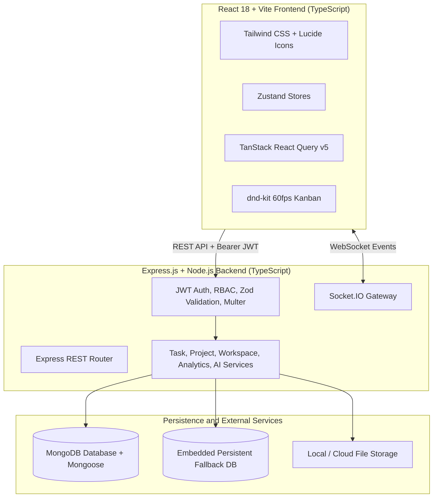

# TaskFlow — Enterprise-Grade Task & Project Management Platform

[](https://github.com/VinayKrishna-7/TaskFlow)
[](https://www.typescriptlang.org/)
[](https://reactjs.org/)
[](https://vitejs.dev/)
[](https://nodejs.org/)
[](https://www.mongodb.com/)
[](https://socket.io/)
[](https://tailwindcss.com/)
[](https://www.docker.com/)
[](https://opensource.org/licenses/MIT)

**TaskFlow** is an enterprise-ready, production-grade team collaboration and task management platform built with the MERN stack (MongoDB, Express, React, Node.js) and TypeScript. Engineered for high performance and zero-lag responsiveness, TaskFlow features real-time WebSocket synchronization, role-based access control (RBAC), accessible 60 FPS drag-and-drop Kanban boards, an AI-assisted project planning engine, productivity analytics, and containerized deployment.

---

## 🌟 Key Features

### 🔐 1. Enterprise Authentication & Session Management
- **Cryptographic JWT Tokens**: Short-lived Access Tokens (15m) paired with rotating Refresh Tokens (7d) stored securely in HttpOnly cookies / localStorage.
- **Granular RBAC**: System-level roles (`USER`, `PROJECT_MANAGER`, `ADMIN`) and Workspace-level permissions (`OWNER`, `ADMIN`, `MEMBER`).
- **Memory & Auto-Redirect**: Persistent user authentication and session memory on your device.
- **Clear Error Messaging**: Real-time validation indicators for existing emails, weak passwords, and incorrect credentials.

### 📋 2. High-Performance 60 FPS Kanban Board
- **Smooth Drag-and-Drop**: Built using `@dnd-kit/core` and `@dnd-kit/sortable` with memoized task cards to eliminate dropped frames.
- **Workflow Columns**: `TODO`, `IN_PROGRESS`, `IN_REVIEW`, and `COMPLETED`.
- **Optimistic UI Updates**: Immediate client state mutation with automatic rollback on network latency or failure.
- **Fractional Ordering**: Collision-free position ordering algorithms preventing race conditions.

### 🤖 3. AI-Assisted Project Planner
- **Intelligent Task Breakdown**: Translates natural language descriptions (e.g. *"Build an e-commerce platform in 2 weeks"*) into structured, prioritised tasks with realistic hourly estimates.
- **Target Project Assignment**: Review, modify, and assign AI-generated tasks directly into custom user projects.
- **Resilient Fallback Engine**: Built-in heuristic breakdown system works out of the box even without external API keys.

### ⚡ 4. Real-Time Collaboration & Synchronization
- **Socket.IO Gateway**: Authenticated WebSocket rooms (`workspace:<id>`, `project:<id>`, `user:<id>`).
- **Instant Updates**: Live updates across all connected clients for task status moves, comment additions, and time log entries.
- **Comments & @Mentions**: Rich conversation threads with `@username` tagging and automated notification triggers.
- **Activity Audit Log**: Chronological, immutable workspace audit trail tracking every modification.

### 📊 5. Rich Analytics & Visualizations
- **Recharts Productivity Dashboard**: Task completion velocity trends (7-day timeline), status distribution donuts, priority breakdowns, and team workload tables.
- **Interactive Calendar**: Full-featured monthly/weekly view mapping tasks and deadlines with overdue indicators.
- **Time Tracking**: Live stopwatch timer and manual session logging with estimated vs. actual hour comparison.

### 🎨 6. Modern SaaS UI (Electric Cobalt & Slate)
- **High-Contrast Design**: Clean Electric Cobalt Blue (`#2563EB`) accent on Obsidian Slate (`#0B0F17`) dark canvas and Porcelain White (`#F8FAFC`) light canvas.
- **Dark/Light Theme Engine**: Zero-flicker theme persistence with system preference detection.
- **Performance Optimized**: Route code-splitting with `React.lazy()` and Rollup chunk partitioning for instant initial load (sub-110 kB entry bundle).

---

## 🏗️ Architecture & Data Flow



---

## 💻 Tech Stack

| Layer | Technology | Description |
|---|---|---|
| **Frontend UI** | React 18, Vite 6, TypeScript | Fast modular frontend with code splitting & lazy loading |
| **Styling** | Tailwind CSS 3.4, clsx, tailwind-merge | Modern SaaS design system with light/dark theme support |
| **Client State** | Zustand & TanStack Query v5 | Multi-layer client state & optimistic server cache |
| **Drag & Drop** | `@dnd-kit/core`, `@dnd-kit/sortable` | High-performance touch and keyboard accessible drag-and-drop |
| **Data Viz** | Recharts | Interactive SVG charts for velocity, workload & status metrics |
| **Backend API** | Node.js 20+, Express.js, TypeScript | Modular MVC architecture (`controllers`, `services`, `routes`, `models`) |
| **Database** | MongoDB 7.0, Mongoose 8 | Indexed document store with aggregation pipelines + persistent embedded fallback |
| **Realtime** | Socket.IO 4.8 | Low-latency room-segregated event broadcasting |
| **Security** | Helmet, bcryptjs, jsonwebtoken, rate-limiter | Defensive security stack with password hashing and brute-force protection |
| **Validation** | Zod | End-to-end type validation for request bodies, queries, and params |
| **Testing** | Vitest, Supertest, Testing Library | Comprehensive unit, integration, and UI component test suites |
| **DevOps** | Docker, Docker Compose, Nginx | Multi-stage production containerization |

---

## 📁 Repository Structure

```text
TaskFlow/
├── client/                     # Frontend Application (React + Vite + TS)
│   ├── src/
│   │   ├── components/         # Reusable UI & Feature components
│   │   │   ├── common/         # Buttons, Inputs, Modals, Navbar, Sidebar, Toasts
│   │   │   ├── kanban/         # KanbanBoard, KanbanColumn, TaskCard
│   │   │   └── tasks/          # TaskDetailModal, TimeTracker, Comments
│   │   ├── layouts/            # AppLayout, AuthLayout
│   │   ├── pages/              # Dashboard, Tasks, Projects, Calendar, Team, Settings, Auth
│   │   ├── routes/             # Lazy-loaded AppRoutes
│   │   ├── store/              # Zustand stores (Auth, Theme, Toast, Confirm, Workspace)
│   │   └── types/              # TypeScript schemas and models
│   ├── tailwind.config.js      # Electric Cobalt & Obsidian Slate tokens
│   └── vite.config.ts          # Rollup manual chunk vendor code-splitting
├── server/                     # Backend API (Node.js + Express + TS)
│   ├── src/
│   │   ├── config/             # DB connection (MongoDB + Embedded fallback), Socket, Swagger
│   │   ├── controllers/        # Request handlers (Auth, Task, Project, Workspace, Analytics, AI)
│   │   ├── middleware/         # Auth, RBAC, Error handler, Rate limit, Multer upload
│   │   ├── models/             # Mongoose schemas (User, Task, Project, Workspace, Notification)
│   │   ├── routes/             # Express API route declarations
│   │   ├── services/           # Business logic & aggregation pipelines
│   │   └── utils/              # Token generation, helpers, seeders
│   └── tests/                  # Backend integration tests
├── docker-compose.yml          # Multi-container full-stack deployment configuration
└── README.md                   # Project documentation
```

---

## ⚡ Quick Start Guide

### Prerequisites
- **Node.js** (v20+ LTS recommended)
- **npm** (v9+)
- *(Optional)* **MongoDB** (If local MongoDB is not running, TaskFlow will automatically launch a persistent embedded database for you seamlessly!)

### 1. Clone the Repository

```bash
git clone https://github.com/VinayKrishna-7/TaskFlow.git
cd TaskFlow
```

### 2. Install Dependencies

```bash
# Install root dependencies
npm install

# Install server dependencies
cd server && npm install

# Install client dependencies
cd ../client && npm install
```

### 3. Setup Environment Variables

```bash
# From project root:
cp server/.env.example server/.env
cp client/.env.example client/.env
```

### 4. (Optional) Seed Sample Workspace & Projects

```bash
cd server
npm run seed
```

### 5. Start Development Servers

From the project root:
```bash
npm run dev
```

Visit:
- **Frontend App**: `http://localhost:5173`
- **Backend API**: `http://localhost:5000/api`
- **Swagger Documentation**: `http://localhost:5000/api-docs`
- **Health Check**: `http://localhost:5000/api/health`

---

## 🐳 Docker Deployment

To launch the complete application with MongoDB, Express API, and Nginx-served React client:

```bash
docker-compose up --build
```

- **Frontend Application**: `http://localhost:80`
- **Backend API**: `http://localhost:5000/api`
- **Swagger Docs**: `http://localhost:5000/api-docs`
- **MongoDB**: `localhost:27017`

To stop containers:
```bash
docker-compose down
```

---

## 🧪 Testing

### Backend Integration Tests
Tests authentication, token refresh, workspace isolation, Kanban movements, time tracking, comments, mentions, and analytics:

```bash
cd server
npm test
```

### Frontend UI & Component Tests
Tests React components, buttons, inputs, badge renders, and empty state fallbacks:

```bash
cd client
npm test
```

---

## 📖 API Reference Summary

Interactive Swagger OpenAPI docs are available at `/api-docs`.

### Authentication (`/api/auth`)
| Method | Endpoint | Description |
|---|---|---|
| `POST` | `/api/auth/register` | Register a new user account |
| `POST` | `/api/auth/login` | Authenticate user & return JWT tokens |
| `POST` | `/api/auth/refresh` | Rotate and issue new access token |
| `POST` | `/api/auth/logout` | Revoke active refresh token session |
| `GET` | `/api/auth/me` | Retrieve authenticated user profile |
| `PUT` | `/api/auth/profile` | Update display name or avatar |
| `PUT` | `/api/auth/change-password` | Update account password |

### Workspaces (`/api/workspaces`)
| Method | Endpoint | Description |
|---|---|---|
| `GET` | `/api/workspaces` | Get all workspaces for current user |
| `POST` | `/api/workspaces` | Create new workspace |
| `GET` | `/api/workspaces/:id` | Get workspace details & members |
| `PUT` | `/api/workspaces/:id` | Update workspace settings |
| `DELETE` | `/api/workspaces/:id` | Delete workspace |
| `POST` | `/api/workspaces/:id/invite` | Invite team member |
| `DELETE` | `/api/workspaces/:id/members/:userId` | Remove member |

### Projects (`/api/projects`)
| Method | Endpoint | Description |
|---|---|---|
| `GET` | `/api/projects` | List projects with completion stats |
| `POST` | `/api/projects` | Create project with key identifier |
| `GET` | `/api/projects/:id` | Get project overview & task stats |
| `PUT` | `/api/projects/:id` | Update project details |
| `DELETE` | `/api/projects/:id` | Delete project and associated tasks |

### Tasks & AI Planner (`/api/tasks`, `/api/ai`)
| Method | Endpoint | Description |
|---|---|---|
| `GET` | `/api/tasks` | Query tasks with search, filters & pagination |
| `POST` | `/api/tasks` | Create new task |
| `GET` | `/api/tasks/:id` | Get full task detail (subtasks, attachments, logs) |
| `PUT` | `/api/tasks/:id` | Update task fields |
| `PUT` | `/api/tasks/:id/move` | Update status & Kanban ordering position |
| `DELETE` | `/api/tasks/:id` | Delete task |
| `POST` | `/api/tasks/:id/duplicate` | Clone task |
| `POST` | `/api/tasks/:id/time` | Log time entry |
| `POST` | `/api/ai/breakdown` | AI prompt to structured task generator |

---

## 📄 License

This project is licensed under the **MIT License** — feel free to use, modify, and distribute.
